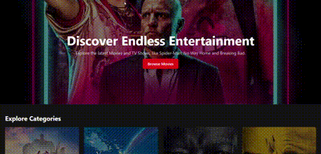
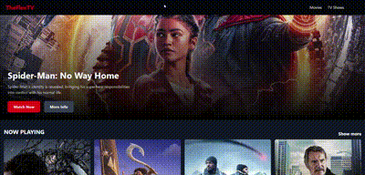
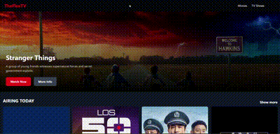

# TheFlexTV

To vist the site [Click-Here](https://theflextv.onrender.com)



TheFlexTV is your one site to check the details of all your current favourite movies and Tv shows. Don't know what to look for? Then you can browse the section with any categories and find the one that you like the best. There are multiple categories and choices.

### Movies


You can check movies in four different categories

- Now playing
- Popular
- Trending
- Upcoming

You can visit each section and check all the movies from this categories. The categories are updated so you'll always get the latest data of the movies.

### TV Shows


You can check the tv shows in four different categories

- Airing today
- On the air
- Popular
- Top rated

You can visit any of these sections and get find the details of the show.

[Visit TheFlexTV](https://theflextv.onrender.com)

## Usage

You can download the zip file to use the project or you can clone this repo:

```bash
https://github.com/ShirajShrestha/TheFlexTV.git
```

Navigate to the folder using:

```bash
cd TheFlexTV
```

Install all the dependencies using following command:

```bash
npm install
```

Run the project using

```bash
npm run dev
```

### Requirement

Before running the project you'll need a tmdb api key, which you'll get for free after signing in the tmdb api. To create an account, you can visit tmdb api or [click here](https://www.themoviedb.org/signup).

- After creating an account, copy the api key.
- Inside the project, create a `.env` file.
- Paste the copied api key in the `.env` file.

  It should be like

  `VITE_API_KEY = PASTE_THE_API_KEY_HERE`
